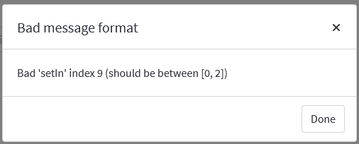

# Baroucoin
Une implémentation d'une chaine de blocs visant à comparer preuve de travail et preuve de participation.

# TODO
### Communication entre les full nodes
- [x] Connexions TCP entre les noeuds
- [x] Sérialisation des messages en JSON
- [x] Récupération des informations avec l'API du serveur
### Échanges d'informations entres les full nodes
- [x] État de la blockchain
- [x] Nouveau bloc trouvé
### 'ProofOfWork'
- [x] Implémentation du minage des blocs
- [x] Vérification du bloc miné
- [X] Vérification des transactions
- [x] Calcul de la récompense de bloc
- [x] Actualisation dynamique de la difficulté par les pairs
### Amélioration du code
- [x] Documentation des tests
- [x] Documentation des classes
- [x] Documentation des fonctions

# Fonctionnement
Cloner le repo Github `git clone` et effectuer les commandes depuis la racine du dossier (baroucoin/).

## Lancement de la simulation et visualisation des graphes
Démarrer le serveur web Streamlit dans un terminal via `run.bat` (Windows), `run.sh` (Linux) ou `python -m streamlit run app\main.py`. Le navigateur s'ouvrira automatiquement ou naviguer à l'adresse `http://localhost:8501/` puis cliquer sur le bouton pour lancer la simulation !

### Bad message format


Si une erreur de ce type survient au lancement, simplement quitter la simulation ('q' dans le terminal), fermer la boîte de dialogue et rafraîchir la page (erreur interne de Streamlit).

# Lancement du serveur
Pour initialiser le serveur (jouant un rôle de DNS central pour simplifier la découvertes des noeuds du réseau), nous utilisons Docker.

En premier lieu, construire l'image :
```
cd /server
```
```
docker build -t barouchain_server .
```
Ensuite, lancer le conteneur avec l'image correspondante :
```
docker run -v $(pwd):/server -p 80:80 barouchain_server
```

# Participants
Ce projet est réalisé par :
- [Alexandre Ondet](https://github.com/AlexandreOndet)
- [Etienne Donneger](https://github.com/Krow10)
- [Maxime Durand](https://github.com/Maxim-Durand)
